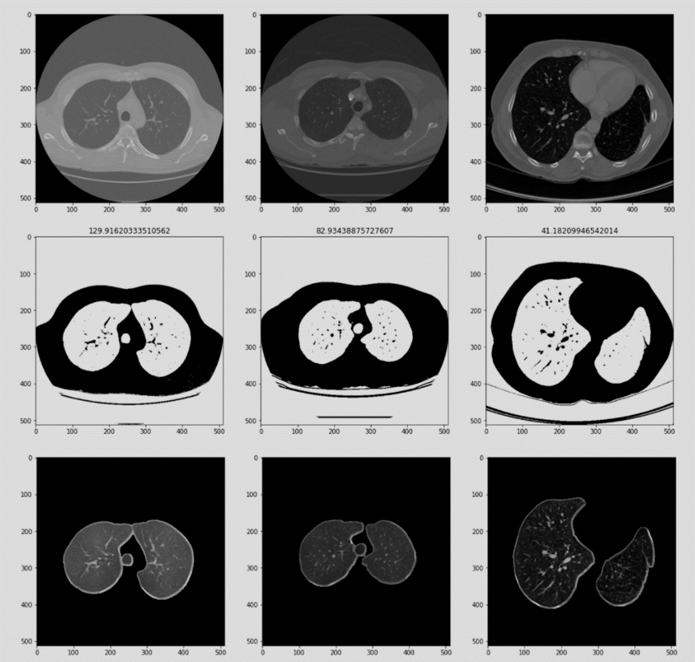

# Lung Nodules Detection

## Overview
Lung cancer is the most common type worldwide, often resulting in death. One key to successfully treating it is to find small lumps, or "nodules," in the lungs early on. Doctors can do this using a particular type of CT scan. However, these nodules only take up minimal space (0.0125 - 0.025%) in the CT scan, so finding them is challenging and prone to mistakes. To solve this, We developed a two-step system. Firstly, We use a convolutional neural network (CNN) to train a model of nodules. It focuses on the lung area. Secondly, We take small sections from this focused area and check them to see any nodules. We tested this method using a widely-recognized lung cancer dataset, and the results are promising. We achieved a score of 0.984 (with a tiny variation of ± 0.0007) when repeating the experiment 10 times, which suggests this could be a reliable way of finding lung nodules.

## Dataset

## Getting Started Guide
### Preprocessing
The preprocessing processe focused on segmenting the ROI (the lungs) from the surrounding regions in the CT images. The detailed breakdown is listed below:

- Extracting Lungs
- Extracting nodule masks
- Binary Thresholding
- Erosion & Dilation for removing noise

### Training

### Testing
